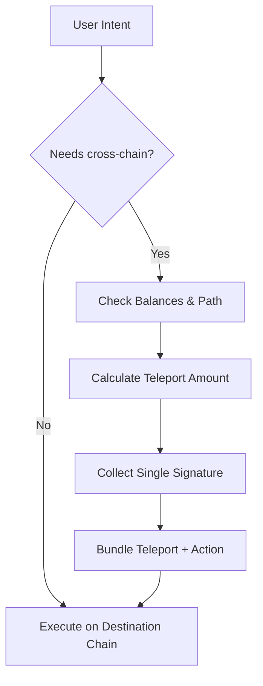

## Technical Foundation

ParaPort is engineered as a modular, TypeScript-first stack that abstracts noisy XCM flows into predictable building blocks.

### Core Technologies
- **TypeScript + Node.js** — Strongly typed runtime powering the core services and shared utilities.
- **ParaSpell** — XCM composition engine that translates user intents into validated cross-chain messages.
- **Polkadot.js API** — Low-level transport for submitting transactions and monitoring finalized blocks.
- **React & Vue Adapters** — Framework-specific bindings that expose stateful hooks and UI primitives.

## Layered Architecture

1. **SDK Layer** — Installable packages (`@paraport/react`, `@paraport/vue`) that provide modals, inline flows, and strongly typed hooks for teleport orchestration.
2. **Core Layer** — Shared logic responsible for balance aggregation, route discovery, fee forecasting, and lifecycle management.
3. **Statics Layer** — Network registry and asset metadata stored in `packages/statick`, including RPC endpoints, existential deposits, and routing hints.
4. **Infrastructure Layer** — ParaSpell-driven XCM builders, endpoint health monitors, and telemetry pipeline.

## Flow Overview

1. **Intent Capture** — SDK receives the primary action (mint, stake, swap) and enriches it with required assets and destination chain.
2. **Balance Discovery** — Core layer aggregates user balances across configured parachains and selects the optimal funding source.
3. **Route Planning** — ParaSpell composes the XCM program with fee buffers and fallback routes.
4. **Signature Flow** — Users sign one guided sequence that bundles teleport and target transaction.
5. **Execution & Monitoring** — ParaPort tracks both legs of the operation, surfaces progress, and exposes callbacks for success, retries, or manual intervention.

## Deployment Footprint

ParaPort currently supports:
- **Polkadot Hub** and **AssetHub**
- **Hydration Parachain** with native token routing
- **People Chain** signature flows for identity-driven interactions

Additional parachains can be enabled via configuration—no code changes required.

::u-button
---
to: /features
color: primary
class: chaotic-btn
---
Explore the Feature Set
::
